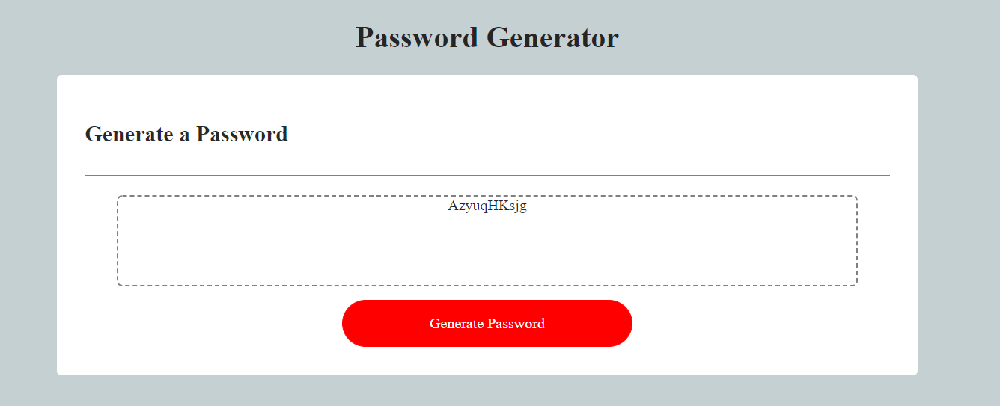

# Password Generator
Click [here](https://ancosta993.github.io/password-generator/) for the project.

## Introduction
This project is written in HTMl, CSS, and JavsScript. It generates a password with criterias chosen by the user. The user picks only the criterias they want and the
poject randomly chooses characters from those criterias and concatanets it into a password. The password is then displayed in the site panel for the user.

## Website Structure 
 - There is a `header` element that encloses the title of the project in the website. 
 - A `
` element is then used for the panel that will display the generated password.
   - Styled with dashed border to display its space.
 - A `
` element is added and styled to look like a traditional button.
   - Border was used to wrap its text content.
   - It was given a highly contrasting color. 
   - A `scale` property was added to its style for a visual confirmation of the click.

## Functionality
- The user clicks on the generate pass word button.
- The window object prompts the user to enter a lenght of password.
- The given lenght is accepted as long as the value is between and including 8 to 128. Otherwise the user is prompt to re-enter a valid value.
- After the length, the user is asked to confirm if they would like to include uppercase, lowercase, special characters, or numerics in their password.
- The user confirms the criterias. They must confirm at least on criteria, otherwise the user is asked to choose criteras again.
- After the user confirms their critera of choice, a string is displayed in the HTML page.
- That string contains characters only from the criterias the user has confirmed. That string is the password.

## Logic (Psudocode)
Logic was written completely in JavaScript. At the top, it declares a character object `characterObj`:
`var characterObj = {
   lowercase:"abcdefghijklmnopqrstubxyz",
   uppercase:"ABCDEGHIJKLMNOPQRSTUVWXYZ",
   numeric:"1234567890",
   specialCharacter:"!#$%&'()*+,-./:;<=>?@[\]^_`{|}~"
};`

The rest of the code is then divided into five funtions: 
-`get_pass_len()`
-`confirm_chosen_char()`
-`randomNumber(max)`
-`password(character, required_length)`
-`passwordGenerator()`

### get_pass_len()
 - Prompts the user to enter a password of length 8 to 128/
 - Uses conditionals to validate the password length
  - returns the length as an integer if the the lenght is valid
### confimr_chosen_char()
 - initiates an empty string and assigns to the variable `character`.
 - confirms the user for including the crietrias lowercase, uppercase, numerics, or special_char in the password
  - If user confirms a criteria, then that criteria is accessed from the `characterObj` propery, and contanates to `character` string created earilier in the lcoal scope.
  - Criterias that are accessed from the `characterObj` as the user confirms them. So, criterias are not concatanated to the `character` variable if user does not confirm it.
 - Uses conditional to validate at least one of the criteria is chosen.
  - Restarts the function if it is not met.
  - Returns the string `character`, otherwise. The string now should have all the chracters that the user has chosen to be in their password.
### randomNumber(max)
- generates a random number from 0 to a given argument, max.
- this function will be called by another function later on.
- the max parameter will be assigned according to the `character` string from `confirm_chosen_char()` string.
 - max parameter will be the length of the `character` string: `character.length`
### password(character, required_length)
- makes the actual password.
- initiates an empty string with `empty_pass`.
- uses for loop to iterate `required_lenght` times.
 - on every iteration:
  - it uses `randomNumber(character.length-1)` to randomly choose a number and assigns it to `random_num`.
  - use the `random_num` as an index to choose a character from the `character` argument. (it was returned from the `confirm_chosen_char()`).
  - concatanate that chosen charater to `empty_pass`.
 - return `empty_pass`.

### passwordGenerator()
- It calls all the previous functions.
- calls `get_pass_len()` and assigns its value to `pass_len` (declared locally).
- calls `confirm_chosen_char()` and assigns its value to `characters` (declared locally).
- calls `passowrd(character, pass_len)` (using the variables from above functions) and assigns the value to a `pass`.
- returns pass (the generated password in string)

## Bug
- Password generated that are of more than 40 characters long overflows the `div` element that displays the generated password.
- A GIF needs to be added in the README.md for a demonstration.

## Finished Look

